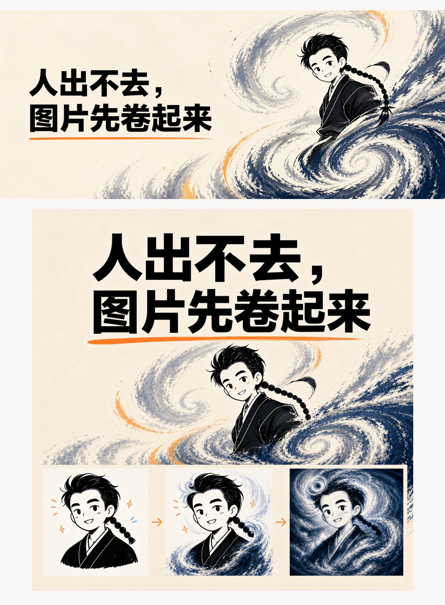

  
    
  <h1>气旋三阶</h1>
  
把一张图，慢慢变成一场气旋。

  

    <a href="SKILL.md">查看 Skill</a>
    ·
    <a href="references/prompt-spec.md">查看提示词</a>
    ·
    <a href="https://github.com/bianzigege/cyclone-morph-skill/releases/latest">下载 Skill 包</a>
  

## 不是直接套一个台风滤镜

这个 Skill 会让同一张图片经过三个连续阶段：

  <table>
    <tr>
      <td align="center"></td>
      <td align="center">→</td>
      <td align="center"></td>
      <td align="center">→</td>
      <td align="center"></td>
      <td align="center">→</td>
      <td align="center"></td>
    </tr>
    <tr>
      <th>原图</th>
      <th></th>
      <th>30%</th>
      <th></th>
      <th>60%</th>
      <th></th>
      <th>100%</th>
    </tr>
  </table>

30% 保留原图，局部开始变成旋涡；60% 让大部分结构进入云系；100% 完全成为卫星台风，但仍然继承原图的中心、流向和明暗关系。

## 三种气质

默认是冷峻的卫星影像，也可以切换成迷幻嬉皮或黑白橙的编辑台气旋感。

  <table>
    <tr>
      <td align="center"></td>
      <td align="center"></td>
    </tr>
    <tr>
      <th>冷峻卫星</th>
      <th>迷幻嬉皮</th>
    </tr>
  </table>

嬉皮版本会使用更大胆的靛蓝、青绿、橙黄、珊瑚、洋红和紫色，并加入轻微的手工印刷颗粒，但气旋的眼、眼墙和旋臂结构不变。

新增的 **橙线气旋｜Orange Line Cyclone** 只通过提示词定义白底、黑色结构线、模块秩序和少量橙色行动信号，不上传编辑台或 Obsidian 截图。最终 100% 阶段不会保留 UI、按钮或可读文字。

## 使用

1. 上传一张图片。
2. 自动生成 30%、60%、100% 三个阶段。
3. 选择下一步：保留更多原图、平衡深化，或推进终态。

支持人物、动物、建筑、房间、产品、车辆、Logo、插画、植物、风景和抽象纹理。

## 文件

- [`SKILL.md`](SKILL.md) — 主流程和交互规则
- [`references/prompt-spec.md`](references/prompt-spec.md) — 三阶段提示词
- [`examples/`](examples/) — 示例图片

用户明确要求时，也可以使用四阶段：**20% → 45% → 70% → 100%**。

## 辫子哥哥气旋化案例

**标题：人出不去，图片先卷起来｜一键气旋化视觉案例**

同一张图，不是直接套一层台风滤镜，而是经过 **30% → 60% → 100%** 三个连续阶段：先保留主体，再让局部结构卷入云系，最后完全进入气旋。这里用公众号横图与 1:1 拼图做上下展示，保留辫子、黑色线稿和传统服饰，让气旋成为辫子哥哥 IP 的环境、动作和结构。

### 带标题封面

  
    
  
    
  

### 无文字 IP 插画

  <table>
    <tr>
      <td></td>
      <td></td>
      <td></td>
    </tr>
  </table>

对应的生成提示词与使用说明见 [`references/generated-case-prompts.md`](references/generated-case-prompts.md)。
