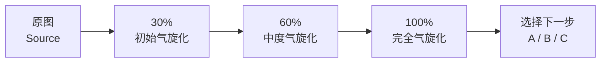

# 气旋三阶 · Cyclone Progression

> Turn anything into a cyclone — one source image, three visible stages.

把任意一张图片，从「原图」逐步转译成「真实卫星台风影像」：先让用户看懂哪些部分正在变化，再让主体完全融入气旋。

## The progression

| 阶段 | 目标 | 视觉关系 |
| --- | --- | --- |
| **30%** | 初始气旋化 | 原图最清楚，少数区域开始云化、旋涡化 |
| **60%** | 中度气旋化 | 主体仍可辨认，大部分结构进入气旋语言 |
| **100%** | 完全气旋化 | 完全成为卫星台风，同时保留原图视觉 DNA |

每一阶段都会继承上一阶段的中心、旋转方向、主要旋臂和源图特征，不会生成三张互不相关的台风图。

## What it can transform

人物、动物、建筑、房间、产品、车辆、Logo、服装、植物、风景、插画、手写字、纹理，以及任何具有轮廓、线条或纹理的视觉对象。

## After generation

生成三张阶段图后，用户可以选择：

- **A｜保留更多原图**：回到 30% 阶段，强化主体识别。
- **B｜平衡深化**：以 60% 阶段为基础继续调整。
- **C｜推进终态**：以 100% 阶段为基础增强卫星台风质感。

## Files

- [`SKILL.md`](SKILL.md) — Skill 主流程、质量门槛与交互规范
- [`references/prompt-spec.md`](references/prompt-spec.md) — 三阶段提示词与四阶段进阶模式

## Optional four-stage mode

用户明确要求时，可切换为：**20% → 45% → 70% → 100%**。

## License

此仓库中的 Skill 内容可按项目需要使用和修改。
